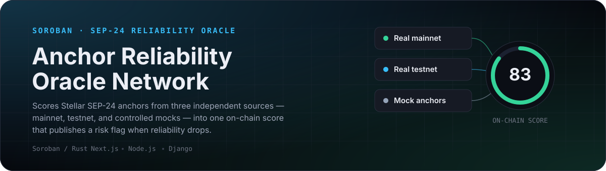
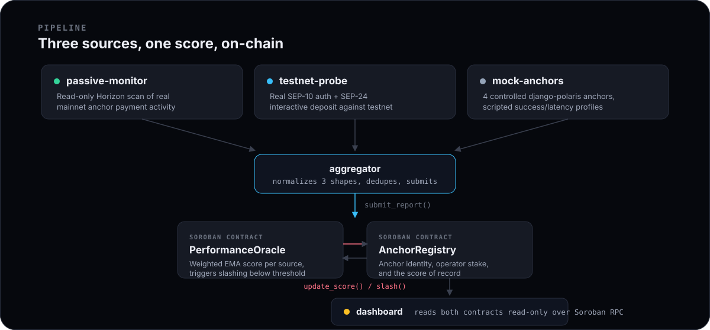

<p align="center">
  
</p>

<p align="center">
  <a href="#quick-start"><b>Quick start</b></a> ·
  <a href="#how-it-works"><b>How it works</b></a> ·
  <a href="#running-the-full-system"><b>Run it locally</b></a> ·
  <a href="#deployed-testnet-contracts"><b>Deployed contracts</b></a> ·
  <a href="#repository-layout"><b>Repository layout</b></a>
</p>

## What this is

Anyone can *claim* a Stellar SEP-24 anchor is reliable. This project measures it, on-chain, from evidence a wallet or user can't fake:

- **Real mainnet reachability** — does the anchor's live API actually answer a wallet today? Every live SEP-6/24 anchor on mainnet is discovered automatically and checked without moving funds.
- **Real testnet behavior** — does a live SEP-10 + SEP-24 deposit against it actually complete?
- **Controlled reference anchors** — a known-good and known-bad anchor, so the scoring math itself can be validated against ground truth.

Every mainnet anchor gets a **score card** computed from 30 days of those checks: four pillars (availability, speed, integrity, and, for anchors that issue their own fiat asset, how well it holds its peg), a separate **confidence** that says how much was measured, and hard gates that cap the score on an outage or a signing problem. The card is published on a [Soroban](https://developers.stellar.org/docs/build/smart-contracts/overview) contract with the SHA-256 of the inputs it was computed from, and the inputs are published, so anyone can recompute it. The method is in [`docs/SCORING.md`](docs/SCORING.md). The contract publishes the verdict openly; it never slashes or moves anyone's stake. A live dashboard reads it from the chain.

Nothing here trades real assets. Mainnet is read-only. Testnet is where every write happens.

## How it works

<p align="center">
  
</p>

1. **Three collectors** independently observe anchor behavior and each emit a normalized `{ success, settlement_seconds, source_type }` report.
2. **`aggregator`** dedupes those reports and calls `PerformanceOracle.submit_report()` on testnet, signed by a reporter key authorized for that source type.
3. **`PerformanceOracle`** keeps, per report, a weighted exponential moving average and an on-chain health record: a fast and a slow EMA whose gap gives the trend, a consecutive-failure counter, and a 20-report outcome window. After the reports, the aggregator computes each mainnet anchor's **score card** off-chain and publishes it with `publish_score_card`, together with the hash of its published inputs bundle; from then on the card is that anchor's headline and reports no longer overwrite it (testnet and reference anchors keep the EMA). The oracle flags an anchor at risk when 3 reports in a row fail, when fewer than half of the recent window succeeded, or when the headline reaches 55 (not judged while a card's confidence is under 40), and emits `risk_status_changed` on each transition.
4. **`AnchorRegistry`** is the source of truth for anchor identity, operator, staked collateral, and current score.
5. **`dashboard`** reads both contracts straight from Soroban RPC. Score history older than the public RPC's 7-day event window comes from `history-archiver`'s durable archive, fetched server-side and merged in; without it the dashboard still renders, with a shorter chart.

| Source type | Produced by | What "success" means |
| --- | --- | --- |
| `RealMainnet` | `services/mainnet-probe` | The anchor's live stellar.toml, transfer server `/info` and SEP-10 challenge all answer, and a SEP-24 deposit can be started (then abandoned — no funds move). An anchor declining an anonymous wallet by policy still counts as reachable |
| `RealTestnet` | `services/testnet-probe` | A real SEP-10 auth + SEP-24 interactive deposit against the anchor actually reaches a terminal state |
| `SimulatedMock` | `services/mock-anchors` | A scripted, seeded behavior profile (success rate, latency, optional time-based degradation) |

## Repository layout

| Path | Stack | Role |
| --- | --- | --- |
| [`contracts/anchor-registry`](contracts/anchor-registry) | Rust / Soroban | Anchor identity, optional stake, score of record (0 until scored) |
| [`contracts/performance-oracle`](contracts/performance-oracle) | Rust / Soroban | Score cards, per-report EMA, trend and risk floor, cross-contract calls into `anchor-registry` |
| [`services/mainnet-probe`](services/mainnet-probe) | Node / TypeScript | Discovers every live SEP-6/24 anchor on mainnet and probes its public API without moving funds |
| [`services/passive-monitor`](services/passive-monitor) | Node / TypeScript | Read-only mainnet context and chain signals: mint/burn flows and peg samples of the assets anchors issue. Volume is never scored |
| [`services/testnet-probe`](services/testnet-probe) | Node / TypeScript / Playwright | Live SEP-10 + SEP-24 test against a real testnet anchor |
| [`services/mock-anchors`](services/mock-anchors) | Python / Django / django-polaris | Four fully-controlled SEP-24 anchors with scripted behavior |
| [`services/aggregator`](services/aggregator) | Node / TypeScript | Submits reports from all three sources, and computes, publishes and verifies score cards |
| [`dashboard`](dashboard) | Next.js / TypeScript / Tailwind | Live read-only view of on-chain state |
| [`scripts`](scripts) | Bash | One-shot setup, deploy, and demo scripts |

Each directory has its own README with implementation-level detail.

## Quick start

Everything below **writes to Stellar Testnet only**. `passive-monitor` is the one exception — it only ever reads mainnet.

```bash
cp .env.example .env                  # fill in as you go — scripts below populate most of it
bash scripts/setup-env.sh             # toolchain check + funded deployer account
bash scripts/deploy-contracts.sh      # build + deploy both contracts to testnet
bash scripts/demo.sh                  # bring every service up end-to-end
```

`scripts/demo.sh` is idempotent — safe to re-run, it skips steps already done. See [`docs/DEMO.md`](docs/DEMO.md) for a guided walkthrough.

## Running the full system

### 1. Prerequisites

| Tool | Version | Used by |
| --- | --- | --- |
| [Rust](https://rustup.rs) + `wasm32v1-none` target | 1.82+ | Contracts |
| [`stellar-cli`](https://developers.stellar.org/docs/tools/developer-tools/cli/) | latest | Deploying + invoking contracts |
| [Node.js](https://nodejs.org) | 20+ | `passive-monitor`, `testnet-probe`, `aggregator`, `dashboard` |
| [Python](https://www.python.org) + `venv` | 3.11+ | `mock-anchors` |
| `npm` | bundled with Node | Every Node service (no workspaces — each service is independent) |

```bash
rustup target add wasm32v1-none
cargo install --locked stellar-cli
```

### 2. Configure the environment

```bash
cp .env.example .env
```

The root `.env` is shared by every service (each one also merges its own local `.env` on top, if present). Key groups:

| Variable group | Purpose |
| --- | --- |
| `SOROBAN_RPC_URL`, `SOROBAN_NETWORK_PASSPHRASE`, `HORIZON_TESTNET_URL`, `FRIENDBOT_URL` | Testnet network config |
| `HORIZON_MAINNET_URL` | Mainnet, read-only, `passive-monitor` only |
| `DEPLOYER_SECRET_KEY` / `DEPLOYER_PUBLIC_KEY` | The account that deploys contracts and registers/stakes anchors |
| `REPORTER_MAINNET_SECRET_KEY` / `REPORTER_TESTNET_SECRET_KEY` / `REPORTER_MOCK_SECRET_KEY` | One authorized reporter key per source type |
| `ANCHOR_REGISTRY_CONTRACT_ID` / `PERFORMANCE_ORACLE_CONTRACT_ID` | Filled in automatically by the deploy script |
| `NEXT_PUBLIC_*` | Same values, re-exposed for the browser-side dashboard |
| `SOROBAN_RPC_FALLBACK_URL` | Optional. A second RPC (we use Alchemy, whose URL carries the API key) used when the public one fails, and by the archive's backfill/verify. Server-side only: never give it a `NEXT_PUBLIC_` prefix, never commit it |
| `HISTORY_PREVIOUS_CONTRACTS` | Optional. Earlier deployments as `ORACLE_ID:REGISTRY_ID,...`, so the archive backfill can recover their history |

### 3. Deploy the contracts

```bash
bash scripts/setup-env.sh        # generates + funds a testnet deployer via Friendbot
bash scripts/deploy-contracts.sh # builds both contracts and deploys them to testnet
```

This writes `ANCHOR_REGISTRY_CONTRACT_ID` and `PERFORMANCE_ORACLE_CONTRACT_ID` (plus the `NEXT_PUBLIC_*` mirrors) straight into `.env`.

Register an anchor and authorize a reporter directly with `stellar contract invoke` once deployed — see [`contracts/anchor-registry/README.md`](contracts/anchor-registry/README.md) and [`contracts/performance-oracle/README.md`](contracts/performance-oracle/README.md) for the exact function signatures.

### 4. Run the collectors

Each service is independent — install and run only the ones you need.

| Service | Install | Run | Notes |
| --- | --- | --- | --- |
| `passive-monitor` | `cd services/passive-monitor && npm install` | `npm run start` | Copy `anchors.example.json` → `anchors.json` first and list real mainnet distribution accounts to watch |
| `testnet-probe` | `cd services/testnet-probe && npm install && npx playwright install chromium` | `npm run probe` | One-shot; `npm run schedule` runs it hourly via `node-schedule` |
| `mock-anchors` | `cd services/mock-anchors && python3 -m venv .venv && .venv/bin/pip install -r requirements.txt` | `bash scripts/bootstrap-issuers.sh` then `bash scripts/run-all.sh` | Starts 4 anchors on ports 8001–8004; `scripts/stop-all.sh` tears them down |
| `aggregator` | `cd services/aggregator && npm install` | `npm run aggregate` | Reads all three sources' output, dedupes, calls `submit_report()` on testnet, then publishes due score cards. `npm run score -- --dry-run` prints every card without sending anything; `npm run verify-score -- <hash> --anchor <id>` recomputes a published one |

Run collectors first, `aggregator` last (it only submits what the others have already produced).

#### `mock-anchors` behavior profiles

| Instance | Port | Success rate | Behavior |
| --- | --- | --- | --- |
| `mock_anchor_1` | 8001 | 98% | Consistently reliable, fast settlement |
| `mock_anchor_2` | 8002 | 90% | Decent but slower, occasional failures |
| `mock_anchor_3` | 8003 | 92% → 40% | Reliable at first, degrades sharply after simulated day 20 — the risk-detection scenario |
| `mock_anchor_4` | 8004 | 35% | Unreliable from the start |

`TIME_ACCELERATION` (default `1440`) compresses simulated days into real minutes, so `mock_anchor_3`'s degradation — and the resulting risk flag — shows up roughly 20 real minutes after its first transaction instead of 20 real days.

### 5. Run the dashboard

```bash
cd dashboard
npm install
npm run dev
```

Open `http://localhost:3000`. It reads `AnchorRegistry` and `PerformanceOracle` straight from `NEXT_PUBLIC_SOROBAN_RPC_URL`, falling back to `SOROBAN_RPC_FALLBACK_URL` if that fails. There is no demo data: if the contract IDs aren't set or no RPC answers, the page says so and shows no scores.

### 6. Everything at once

```bash
bash scripts/demo.sh
```

Runs setup, deploy (if needed), every collector once, one aggregation pass, and installs the dashboard — then prints the command to start it. See [`docs/DEMO.md`](docs/DEMO.md) for the full walkthrough, including how to watch `mock_anchor_3` degrade and trip the risk floor live.

### 7. Continuous collection (the deployed setup)

A demo run is a single snapshot. To keep scoring anchors — and to build a
chart that covers more than a few hours — the real collectors run on a
host, on a schedule:

```bash
COLLECTOR_HOST=root@your-host bash scripts/deploy-to-server.sh
```

That syncs the services, installs their dependencies, and leaves
`/var/lib/anchor-status` untouched. Cron then runs one round every 20
minutes:

```
*/20 * * * * root /usr/bin/flock -n /var/lock/anchor-collect.lock /opt/anchor-status/scripts/collect.sh >> /var/log/anchor-status/collect.log 2>&1
```

Deployment is pull-based and deliberate: [`scripts/server-autodeploy.sh`](scripts/server-autodeploy.sh),
run on the host, fetches the tracked branch, installs the dependencies of
any service whose `package.json` changed. It holds the collection lock, so it
never swaps files under a running round. The host authenticates to GitHub
with a read-only deploy key.

The dashboard deploys separately: the Vercel project `anchor-status-g9f7`
(root directory `dashboard/`) is connected to this GitHub repo and builds
every push to `main` on its own. Its server-side env vars
(`ANCHOR_STATUS_URL`, `HISTORY_ARCHIVE_URL`) point at the collector host.

One round is [`scripts/collect.sh`](scripts/collect.sh): `mainnet-probe`
(anchor discovery once a day, registration of any new anchor, then a probe
of every tracked anchor), `passive-monitor`, `testnet-probe`, `aggregator`
(with `AGGREGATOR_SKIP_MOCK=true`, so only real sources are submitted), then
`history-archiver`. `flock` skips a tick rather than stacking rounds when a
probe runs long.

**Nothing accumulated lives in the deployed tree.** Everything that must
survive a redeploy sits in `/var/lib/anchor-status`:

| File | What it holds | Why it must not reset |
| --- | --- | --- |
| `history.json` | Every score point and risk transition ever observed (plus slash events from the previous oracle, which slashed) | The public Soroban RPC only serves events for 7 days, so this is the only long-term record |
| `aggregator-state.json` | Dedup keys for reports already submitted | A reset would resubmit tens of thousands of reports |
| `probe-results/probe-log.json` | Every testnet probe run | The `RealTestnet` evidence trail |
| `mainnet-probe/probe-YYYY-MM-DD.jsonl` | Every mainnet probe run, stage by stage, appended per day | The `RealMainnet` evidence trail |
| `mainnet-anchors.json` | Every anchor discovery has ever found | Anchors are only added, never dropped: one that goes down must keep being measured |
| `mainnet-status.json`, `issuers.json` | Each anchor's latest verdict and listed assets; issuer accounts and other domains' tomls, cached a day | Served as `/anchor-status.json`; the dashboard's labels |
| `flows.json`, `market/market-YYYY-MM-DD.jsonl`, `fx.json` | Daily mint/burn counts of every issued asset; every peg sample; today's reference rates | 30 days of flows are backfilled once; samples cannot be re-taken after the fact |
| `score-cards.json`, `score-summary.json` | The last card published per anchor; the confidence factors of each (served as `/score-summary.json`) | Decides what is due for republishing |
| `evidence/<sha256>.json` | Every probe's evidence document and every card's inputs bundle, content-addressed | The hashes are on-chain: the documents are what they point to |

[`services/history-archiver`](services/history-archiver) re-reads the public
RPC's whole 7-day event window each round (one parallel scan for every
anchor, about a second) and merges it into `history.json` by
`(timestamp, value)`, so overlapping rounds never duplicate, a failed round
never drops what is already archived, and the collector can be down for
days without leaving a gap.

Two more commands check the archive against a long-retention RPC (Alchemy
keeps ~70 days of events on testnet):

```bash
cd services/history-archiver
npm run verify    # read-only: which on-chain reports the archive lacks, and
                  # which archived ones no scanned contract ever emitted
npm run backfill  # the same report, then merges the missing reports in
```

Both read every deployment in `HISTORY_PREVIOUS_CONTRACTS` as well as the
current one. The file is written via temp +
rename with a `.bak` copy, and served read-only over HTTP; the dashboard
reads it from `HISTORY_ARCHIVE_URL` server-side and unions it into the live
contract read. If it is unreachable the dashboard still renders live data —
just with a shorter chart.

## Deployed testnet contracts

| Contract | Contract ID |
| --- | --- |
| `AnchorRegistry` | [`CBQGNUIX5ZDQOE6VBDHTF3SSWSCNMYK37ES5CBYUTQAED7NLZOFEE4AB`](https://stellar.expert/explorer/testnet/contract/CBQGNUIX5ZDQOE6VBDHTF3SSWSCNMYK37ES5CBYUTQAED7NLZOFEE4AB) |
| `PerformanceOracle` | [`CBDDBO5YU3MERDJ7LFA5RIXFORW5HI3NKMK67TG5TPO5QT64M5GUWGWU`](https://stellar.expert/explorer/testnet/contract/CBDDBO5YU3MERDJ7LFA5RIXFORW5HI3NKMK67TG5TPO5QT64M5GUWGWU) |

Network: Stellar Testnet (`Test SDF Network ; September 2015`). For code changes use `scripts/upgrade-contracts.sh`, which keeps these IDs. Only a fresh `scripts/deploy-contracts.sh` creates new ones (and writes them into `.env`) — update this table if you do.

## Testing

Every contract and service ships with its own test suite; none require network access.

```bash
(cd contracts/anchor-registry && cargo test)
(cd contracts/performance-oracle && cargo test)
(cd services/passive-monitor && npm test)
(cd services/testnet-probe && npm test)
(cd services/aggregator && npm test)
(cd services/mock-anchors && .venv/bin/pytest)
(cd dashboard && npm test)
```

## Design notes

- **Mainnet stays read-only.** `passive-monitor` never signs or submits a mainnet transaction — it only scans Horizon payment history for anchors you list.
- **Score math** ([`docs/SCORING.md`](docs/SCORING.md)): mainnet anchors are scored by a card over 30 days: availability (uptime, shaped by "nines"), speed (p95 of the mean stage time), integrity (a weighted checklist: valid toml with CORS, anchor-signed SEP-10, valid `/info`, TLS, a stable signing key, and assets their issuers vouch for), and market (peg deviation, only for a fiat asset the anchor issues and only on a liquid market). The weighted pillars are shrunk toward 50 by a separate confidence (days monitored, checks, and how deep we could test), then capped by gates (OUTAGE 50, LOW_UPTIME 60, SEP10_MISMATCH 40, DEPEG 50, ONE_WAY_FLOW 70). Below a confidence of 40 the number is withheld; the flags are still shown. Testnet and reference anchors keep the per-report EMA.
- **No slashing.** The oracle is a neutral measurement layer: it publishes a score, a trend and a risk flag, and `AnchorRegistry` has no slashing entry point at all. An earlier version slashed 10% of stake automatically; on testnet it was triggered by bugs in our own probe, which is exactly why a measurement error must not be able to cost an operator money.
- **Trend and risk floor live in contract state**, not in event history, so detecting them never depends on how long an RPC node keeps events. Transaction volume never adds points: the number of checks feeds confidence only, and an anchor's age is shown as context only.
- **Cross-contract authorization**: `PerformanceOracle` is the only caller `AnchorRegistry` accepts for `update_score`, enforced by Soroban's own invoker-authentication — no shared secret or allowlist needed.
- **Verifiable, not trusted.** Each report can carry the SHA-256 of a published evidence document, emitted on-chain with the score change: the anchor's own signed SEP-10 challenge and, for testnet deposits, the payout on the ledger. `npm run verify -- <hash>` in `services/mainnet-probe` checks one independently. A score card's inputs bundle is checked the same way with `npm run verify-score` in `services/aggregator`, which recomputes the card and compares it with the one on-chain.
- **Upgrades keep the address.** Both contracts have an admin-only `upgrade`; `scripts/upgrade-contracts.sh` replaces the code in place, so a fix doesn't change contract IDs or reset state.

## License

No license file is currently published for this repository. Treat the code as all-rights-reserved unless the repository owner adds one.
